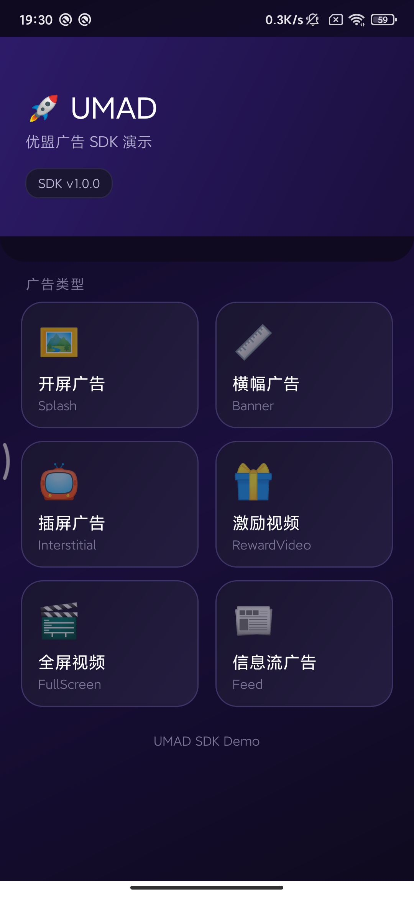
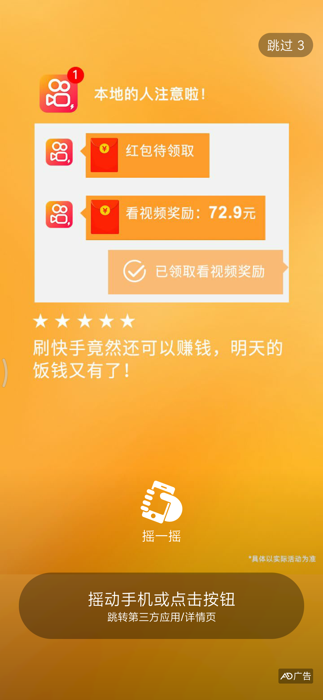
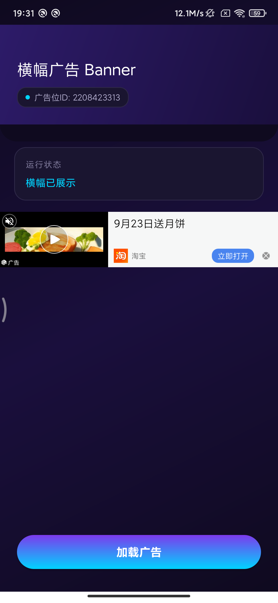
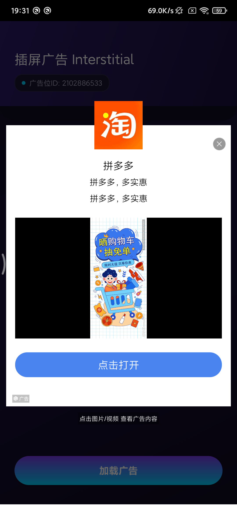
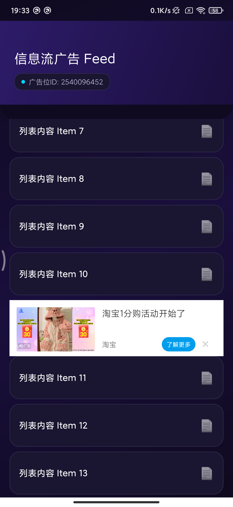

# UMAD SDK — 优盟广告聚合引擎

一款轻量、高效的 Android 广告聚合 SDK，一站式接入穿山甲、快手、优量汇、百度、瑞狮等多家主流广告平台，帮你快速实现广告变现。

## 核心优势

- **一站式接入**：一次集成，对接多家广告平台，省去逐个对接的成本
- **两大调度模式**：支持 **Waterfall 瀑布流** 和 **客户端 Bidding 竞价** 两种模式，可混合使用
- **智能瀑布流优化**：内置基于本地数据的动态排序和底价过滤算法，越用越聪明
- **六大广告类型**：开屏、横幅、插屏、激励视频、全屏视频、信息流全覆盖
- **配置灵活**：JSON 配置广告位，无需硬编码，支持动态下发
- **轻量稳定**：API 简洁，接入成本低，运行稳定

---

## 核心机制

### 🏞️ 一、Waterfall 瀑布流

按配置顺序依次请求广告平台，上一家没填充才请求下一家，保证填充率。

```
第1层 → 穿山甲（高eCPM）
  ↓ 无填充
第2层 → 优量汇（中eCPM）
  ↓ 无填充
第3层 → 瑞狮（兜底）
```

- 配置简单，在 `ad_config.json` 里按顺序写就行
- 适合对填充率要求高的场景
- 支持**任意层级**，每层可配置不同平台

### ⚖️ 二、客户端 Bidding 竞价

同时请求多家广告平台，全部返回后**比价**，选 eCPM 最高的展示，并通知胜出/失败结果。

```
同时请求 → 穿山甲 ¥50  |  优量汇 ¥45  |  瑞狮 ¥30
                  ↓
           最高价胜出 → 展示穿山甲
           其余平台 → 通知 biddingFailed
```

- **收益最大化**：价高者得，不会浪费高价流量
- **减少请求层数**：并行请求，加载更快
- 支持的平台：穿山甲（CSJ）、上推（ST）等（持续扩展中）

> 💡 **两种模式可混合**：高层 Bidding 比价，Bidding 都没填充时再走 Waterfall 兜底，兼顾收益与填充。

### 🧠 三、智能瀑布流优化（默认开启）

SDK 内置 `AdOptimizer` 模块，基于本地统计的历史表现数据，**动态调整瀑布流顺序**、**底价过滤**和**动态延迟加载**，越用收益越高。

#### 1. 动态排序

根据各平台的 **填充率 × eCPM × 加载速度** 计算综合得分，得分高的排前面。

- 新平台保护：无数据的新平台默认给最高分的 60%，保证有探索机会
- 冷启动时保持原始配置顺序，数据积累后自动生效

#### 2. 底价过滤

如果当前已有新鲜缓存（30 分钟内）的最高价广告，后续预估打不过的平台**直接跳过不请求**：

```
保守预估 eCPM = 历史平均 × 0.7（近似 P25 分位）
底价线 = 当前最高价 × 0.9
保守预估 < 底价线 → 跳过该平台
```

- 省流量、省时间
- 保护上游账号质量（减少无效请求）

#### 3. 动态延迟加载（DynamicLoadHelper）

第一个广告返回后**不立刻回调**，再多等一小段时间，让更高价的广告有机会返回，确保展示的是当前收益最高的广告。

```
t=0    开始加载
  ├─ 穿山甲（高价） ← 还在路上
  └─ 瑞狮（低价）   ← t=800ms 先回来了 ❌ 不立刻回调
                         继续等待...
t=1500ms 穿山甲返回 ✅ 取最高价展示
```

两个时间阈值：

- **maxWaitAfterFirstMs**：第一个广告回来后最多再等多久（默认 1500ms）
- **totalMaxWaitMs**：从 load 开始总等待时间上限，避免用户等太久（默认 2000ms）

取两者中更早到达的时间点回调，兼顾收益与体验。

#### 4. 使用方式

```java
// 开关（默认开启）
AdOptimizer.setEnabled(true);

// 打开调试日志，查看排序过程和各平台得分
AdOptimizer.setDebugLog(true);

// App 退到后台时落盘统计数据（建议调用）
AdOptimizer.flush();

// 查看某个广告位+平台的性能数据
AdPerfData data = AdOptimizer.getPerfData("广告位ID", "CSJ");
```

> 📊 所有统计数据仅保存在本地（SharedPreferences），不上传服务器，不涉及用户隐私。

---

## 效果预览

| 主页面 | 开屏广告 | 横幅广告 |
|:---:|:---:|:---:|
|  |  |  |
| 首页入口 | 全屏开屏 | 横幅展示 |

| 插屏广告 | 激励视频 | 信息流广告 |
|:---:|:---:|:---:|
|  |  |  |
| 插屏弹窗 | 激励视频 | 信息流混排 |

---

## 支持的广告类型

| 广告类型 | 说明 |
|---------|------|
| 开屏广告 (Splash) | 应用启动时全屏展示，高 eCPM |
| 横幅广告 (Banner) | 页面内固定区域展示，场景灵活 |
| 插屏广告 (Interstitial) | 页面切换时弹出，高点击率 |
| 激励视频 (RewardVideo) | 用户看完后发放奖励，深度变现 |
| 全屏视频 (FullScreen) | 全屏视频广告，沉浸式体验 |
| 信息流广告 (Feed) | 原生信息流，融入内容体验佳 |

---

## 一、快速接入（三步）

### 1. 引入 SDK

将 `umad-core-x.x.x.aar` 放入 `app/libs/` 目录：

```groovy
// app/build.gradle
dependencies {
    // 优盟广告 SDK
    implementation files('libs/umad-core-1.0.0.aar')

    // 基础依赖
    implementation 'androidx.appcompat:appcompat:1.0.0'
    implementation 'androidx.recyclerview:recyclerview:1.0.0'
    implementation 'com.google.android.material:material:1.6.0'

    // 接入的广告平台 SDK（按需引入，以穿山甲 + 瑞狮为例）
    implementation files('libs/CSJ_v7.4.2.0.aar')     // 穿山甲
    implementation files('libs/OAID_v1.0.25.aar')     // OAID（穿山甲依赖）

    // 瑞狮 SDK
    implementation('cn.vlion.inland:vlion-core-ec:7.00.81') {
        exclude group: 'cn.vlion.inland', module: 'vlion-j'
        exclude group: 'cn.vlion.inland', module: 'vlion-wm-sdk'
    }
}
```

> 💡 **按需引入平台 SDK**：SDK 内部聚合了多家广告平台，`ad_config.json` 里配置了哪些平台，就引入对应平台的 SDK。用不到的平台无需引入，控制包体大小。

### 2. 配置广告位

在 `app/src/main/assets/ad_config.json` 中配置每个广告位的广告源：

```json
{
  "2629995460": {
    "advertises": [
      { "platform": "CSJ", "appId": "5000000", "adId": "10000000" },
      { "platform": "RS",  "appId": "A0732",  "adId": "P4009", "appKey": "xxxxx" }
    ]
  }
}
```

- **key**：广告位 ID，代码中通过 `new SplashAd("广告位ID")` 对应
- **advertises[]**：该广告位的广告源列表，按顺序瀑布请求
  - `platform`：平台代号（`CSJ` 穿山甲 / `KS` 快手 / `YLH` 优量汇 / `BD` 百度 / `RS` 瑞狮 / `ST` 上推 等）
  - `appId` / `adId` / `appKey`：对应平台的申请参数

### 3. 初始化 SDK

在 `Application.onCreate()` 中初始化，SDK 会自动读取 `ad_config.json`：

```java
public class App extends Application {
    @Override
    public void onCreate() {
        super.onCreate();
        UMAD.init(this);   // 一行代码初始化
    }
}
```

---

## 二、各广告类型使用

所有广告统一调用模式：**创建广告对象 → 设置监听 → load 加载 → 回调成功后 show 展示**。

### 2.1 开屏广告 SplashAd

```java
SplashAd ad = new SplashAd("2629995460");
ad.setAdLoadListener(new AdLoadListener() {
    @Override public void onLoad() {
        ad.show(container);   // 加载成功，展示到容器
    }
    @Override public void onNoAd(int code, String msg) {
        // 无广告，进入主页面
    }
});
ad.load(activity);
```

- 建议在启动页 `onCreate` 中立即调用
- 容器建议使用全屏 FrameLayout，配合沉浸式体验更好

### 2.2 横幅广告 BannerAd

```java
BannerAd ad = new BannerAd("2208423313");
ad.setAdLoadListener(new AdLoadListener() {
    @Override public void onLoad() {
        ad.show(container);
    }
    @Override public void onNoAd(int code, String msg) { }
});
ad.load(activity, width, 0);   // width 为容器宽度，height 传 0 使用默认高度
```

### 2.3 插屏广告 InterstitialAd

```java
InterstitialAd ad = new InterstitialAd("2102886533");
ad.setAdLoadListener(new AdLoadListener() {
    @Override public void onLoad() {
        ad.show(activity);
    }
    @Override public void onNoAd(int code, String msg) { }
});
ad.load(activity);
```

### 2.4 激励视频 RewardVideoAd

```java
RewardVideoAd ad = new RewardVideoAd("2919646015");

// 播放回调
ad.setVideoPlayListener(new VideoPlayListener() {
    @Override public void onPlayStart()  { }
    @Override public void onPlaySkip()   { }
    @Override public void onPlayFinish() { }
});

// 展示 / 发奖回调
ad.setAdViewListener(new AdViewListener() {
    @Override public void onShow()  { }
    @Override public void onClose() { }
    @Override public void onClick() { }
    @Override public void onReward() {     // ✅ 满足发奖条件
        // 在此处发放奖励
    }
    @Override public void onResourceError() { }
});

ad.setAdLoadListener(new AdLoadListener() {
    @Override public void onLoad() {
        ad.show(activity);
    }
    @Override public void onNoAd(int code, String msg) { }
});
ad.load(context);
```

### 2.5 全屏视频 FullScreenAd

```java
FullScreenAd ad = new FullScreenAd("2021839469");
ad.setAdLoadListener(new AdLoadListener() {
    @Override public void onLoad() {
        ad.show(activity);
    }
    @Override public void onNoAd(int code, String msg) { }
});
ad.load(activity);
```

### 2.6 信息流广告 FeedAd

```java
FeedAd ad = new FeedAd("2540096452");
ad.setAdLoadListener(new FeedLoadListener() {
    @Override public void onLoad(List<FeedAdData> list) {
        for (FeedAdData data : list) {
            data.render();                // 渲染广告
            View adView = data.getAdView();  // 获取广告视图，加入列表
        }
    }
    @Override public void onNoAd(int code, String msg) { }
});
ad.load(activity);
```

---

## 三、回调接口

### AdLoadListener — 加载结果
```java
public interface AdLoadListener {
    void onLoad();                          // 加载成功
    void onNoAd(int code, String message);  // 无广告 / 加载失败
}
```

### AdViewListener — 展示与交互
```java
public interface AdViewListener {
    void onShow();          // 广告展示
    void onClose();         // 广告关闭
    void onClick();         // 广告被点击
    void onReward();        // 激励视频满足发奖条件
    void onResourceError(); // 资源加载异常
}
```

### VideoPlayListener — 视频播放
```java
public interface VideoPlayListener {
    void onPlayStart();     // 开始播放
    void onPlaySkip();      // 用户跳过
    void onPlayFinish();    // 播放完成
}
```

### FeedLoadListener — 信息流加载
```java
public interface FeedLoadListener {
    void onLoad(List<FeedAdData> list);     // 加载成功，返回广告列表
    void onNoAd(int code, String message);  // 无广告
}
```

---

## 四、常见问题

### Q1：支持哪些广告平台？
目前已接入：穿山甲（CSJ）、优量汇（YLH）、百度（BD）、快手（KS）、瑞狮（RS）、上推（ST）、美数（MS）、倍孜（BZ）、章鱼（ZY）、多盟（DM）、脉盟（MM）、塔酷（TK）、Sigmob（SM）、惊鸿动能（HW）、数字悦动（AG）、飞梭（FS）、掌上乐游（LY）、快友（KY）、泛为（FW）、舜飞（SF）等。
如需新增平台支持，欢迎联系我们。

### Q2：广告位配置支持动态下发吗？
支持。除了 `assets/ad_config.json` 静态配置，也支持代码动态传入：

```java
Map<String, String> adPosMap = new HashMap<>();
adPosMap.put("2629995460", "CSJ,5000000,10000000;RS,A0732,P4009,appKey值");
UMAD.init(this, adPosMap);
```

### Q3：平台代号有哪些写法？
支持简称和全称，如 `CSJ` / `CHUANSHANJIA` 都表示穿山甲，`KS` / `KUAISHOU` 都表示快手，SDK 会自动识别。

### Q4：如何打开调试日志？
调用 `ad.enableDebug()` 即可打开详细日志，方便排查问题。上线前建议移除。

### Q5：启动报 ClassNotFoundException？
通常是某个平台 SDK 没有引入。SDK 的 manifest 中声明了各平台的组件（如 FileProvider），如果 `ad_config.json` 里配置了该平台但没有引入对应 SDK，就会报类找不到。

**解决**：确保 `ad_config.json` 中配置的平台，都在 `build.gradle` 中引入了对应 SDK。

### Q6：ad_config.json 里可以写注释吗？
标准 JSON 不支持注释，请不要写 `//` 或 `/* */`，否则会解析失败。

### Q7：错误码有哪些？

`onNoAd(int code, String message)` 回调中的错误码分为两类：

| 错误码 | 说明 | 常见原因 |
|:---:|---|---|
| 1001 | SDK 未初始化 | `UMAD.init()` 未调用或初始化失败，检查 `ad_config.json` 是否存在 |
| 2001 | 广告位错误 | 广告位 ID 未在配置中找到，或广告配置解析失败 |
| 3001 | 调用顺序错误 | 未加载成功就调用 `show()`，请在 `onLoad()` 回调后再展示 |
| 其他 | 第三方平台错误码 | 由各广告平台 SDK 透传，具体含义请参考对应平台的文档 |

---

## 五、Demo 体验

扫码下载 Demo APK，快速体验各广告类型效果：


### 源码编译

Demo 工程位于 `UMengAd/`，可直接编译运行：

```bash
./gradlew assembleDebug
```

APK 输出路径：`app/build/outputs/apk/debug/app-debug.apk`

Demo 中包含了各广告类型的完整示例代码，可参考接入。

---

## 六、技术支持

如有接入问题或商务合作，欢迎扫码添加微信咨询：


*备注：UMAD SDK 合作*

---

*© 优盟广告 UMAD SDK*
